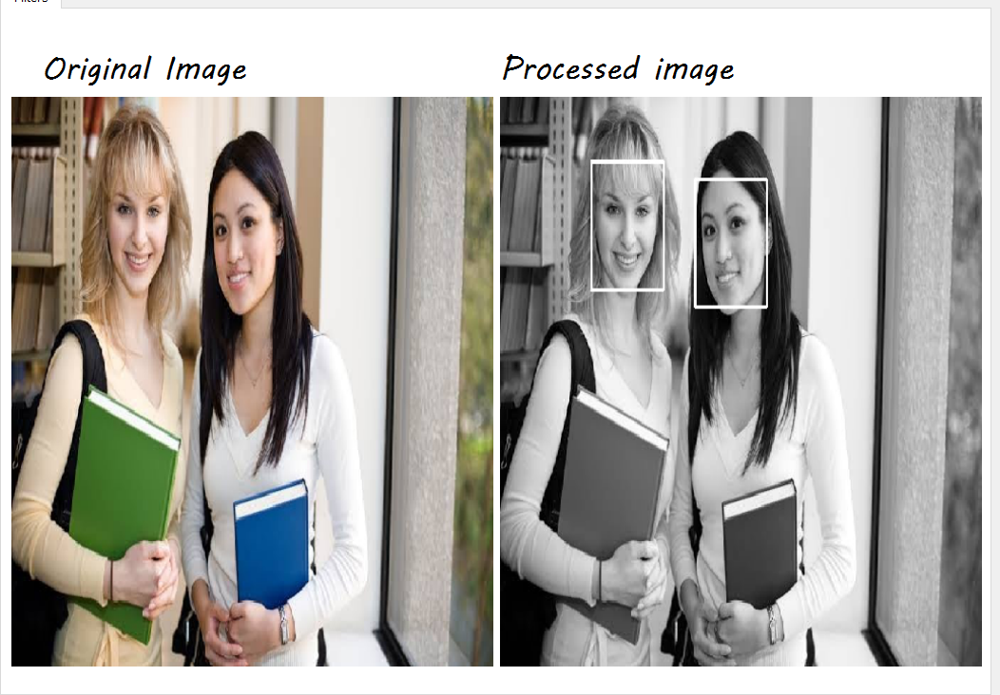
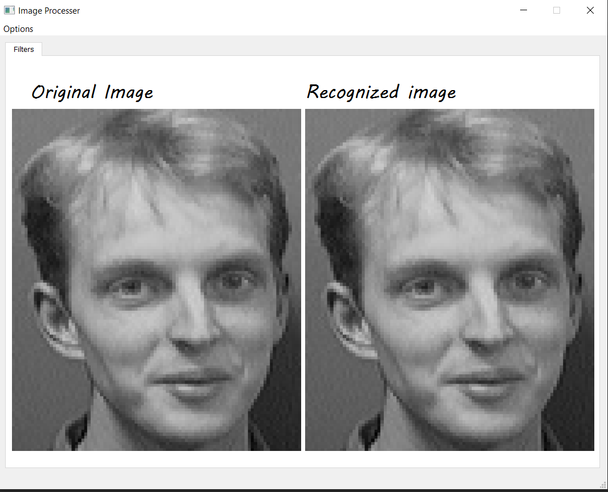
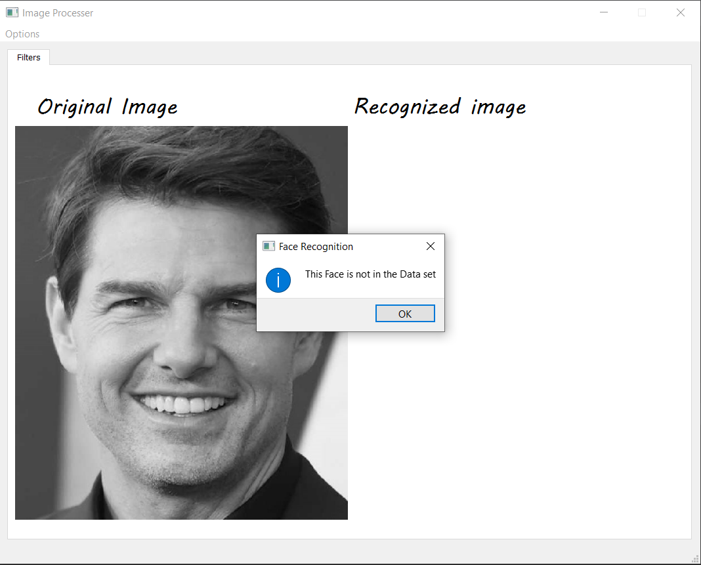

# cv404-2021-final-project-sbe404b-team19
# cv404-2021-final-project-sbe404b-team19
| Submitted to | Prof/ Ahmed M. Badawi |  |  |
| ----------- | ----------- | ----------- | ----------- |
| **By** | - Adel Moustafa | Sec: 2 | Bn: 3 |
|     | - Omar Ibrahim | Sec: 2 | Bn: 9 |
|     | - Mohamed Yasser | Sec: 2 | Bn: 24 |
| | - Mahmoud Abdelrhman | Sec: 2 | Bn: 25 |
| **Group ID** | 19 |  |  |

------

[TOC]

------

# Overview of the task

This project consists of 4 modules:  
1-**main.py**  : main program  
2-**GUI.py** : Pyqt GUI script  
3-**FaceRecognition.py** : contains the implementation of the face recognition algorithm  
4-**FaceDetection.py** : contains the implementation of the face detection algorithm

	
------

# Program description

- **From** Options, you can **choose** any option you like and a pop-up window will be shown to choose an image and the specified option will be applied.

------

# Results

- Face Detection  

  

- Face Recognition(Recognized)
  

- Face Recognition(not Recognized)
  

- [Data set link](https://www.kaggle.com/kasikrit/att-database-of-faces?fbclid=IwAR0JwSzBoue1pt0-36xbmjMtimW7BCWyYxoyg46D2ITEpzzXCraROymkLxI)
